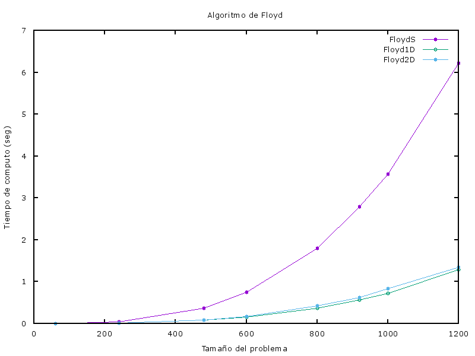
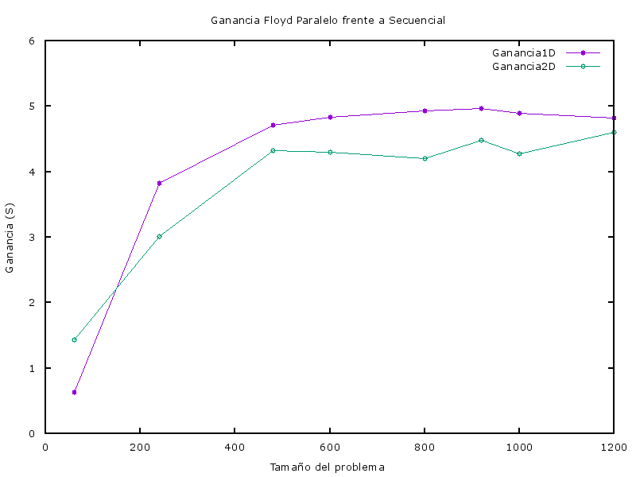

Memoria de Práctica
===================

Se pide implementar el cálculo de todos los caminos mínimos usando el algoritmo de Floyd y haciendo uso del lenguaje de programación C++ y MPI para las versiones paralelas.

La clase *Graph* se encarga de almacenar el grafo etiquetado.
El programa proporcionado *creaejemplo.cpp*  crea archivos de entrada que quedan almacenados en la carpeta input, para ello se tiene que indicar como parámetro de entrada el número de vértices.

Los datos de entrada que tenemos son los siguientes: 60, 240, 480, 600, 800, 920, 1000, 1200.

----------

##1. Versión 1D. Distribución por bloques

La implementación de esta versión está dentro de la carpeta Floyd-1.
En esta versión realizaremos una distribución por bloques de filas, asumimos que el número de vértices *N* es múltiplo del número de procesos *P*.
Se hace un reparto entre los procesos por bloques contiguos de filas, de esta manera cada proceso almacena *N/P* filas de la matriz.
Se podrán usar *N* procesos. Cada uno de ellos se hace cargo de sus filas correspondientes adyacentes de la matriz, y además ejecuta el siguiente algoritmo:

```c++
for(k = 0 ... N-1)
	broadcast(filak)
	for(i = rank*(N/P) ... (rank+1)*(N/P)-1)
		for(j = 0 ... N-1)
			I[i][j] = min(I[i][j], I[i][k] + I[k][j])
```

 - I[i][j],  tanto la *i* como la *j* son locales
 - I[i][k],  *i* es local pero *k* es remota
 - I[k][j],  *k* es remota pero *j* es local

Cada proceso debe conocer su **fila i** y **columna j** locales.
La **fila k** debe ser conocida por todos los procesos, por lo tanto cada proceso debe mandar su *fila k* a todos a través de un ***Broadcast***,  si se da el caso de que la *fila k* pertenece a su bloque no habría problema, pero en el caso en que esta fila no pertenezca a su bloque es entonces cuando otro proceso debe indicársela.

Para la resolución de esta versión tendremos que hacer un reparto de la matriz mediante un ***Scatter***,  acto seguido durante la ejecución del algoritmo de cada proceso tendremos que hacer un ***Broadcast*** y por último tendremos que reunir todos los resultados obtenidos por cada uno de los procesos nuevamente en la matriz, para ello usaremos ***Gather***.

### 1.1 Problemas encontrados y su resolución
####1.1.1 Indices globales a locales
El problema que se nos presenta fue hallar el indice de partida de la *fila k* ya que en mi implementación no usé matrices sino que usé un **vector** de tamaño ***(nverts\*nverts)/numeroProcesos***, por lo tanto para obtener los indices en cada etapa k tuve que hacer lo siguiente: 
```c++
indicePartidaFilaK = (k*nverts)%tamVectorLocal;
```
Una vez que obtuve el indice desde donde comenzaba la fila k de ese proceso tuve que rellenar el vector de la fila k para poder hacer un *Broadcast* de este. Y para rellenarlo tuve que hacer uso del desplazamiento de i hasta el numero de vértices de esa fila partiendo del indice obtenido.

```c++
for(i = 0; i<nverts; i++)
{
	filak[i] = vectorLocal[indicePartidaFilaK + i];
}
```
####1.1.2 Broadcast fila k
Para hacer el *Broadcast* de la fila k tuve que obtener en primer lugar el proceso que se iba a encargar de realizar la difusión, para ello:

```c++
int tamVectorLocal = (nverts*nverts)/numeroProcesos;
int tamFilaLocal = tamVectorLocal/nverts;
// ..........
for(k = 0; k<nverts; k++)
{
	idProcesoBloqueK = k / tamFilaLocal;
	// ..........
}
```
Una vez que obtuve el proceso que se encargaba de ese bloque procedo a hacer la difusión de la *fila k*.
```c++
MPI_Bcast(&filak[0], nverts, MPI_INT, idProcesoBloqueK, MPI_COMM_WORLD);
```

##2. Versión 2D. Distribución por submatrices
La implementación de esta versión está dentro de la carpeta Floyd-2.
En esta versión realizaremos una distribución por bloques bidimensionales o 2D, asumimos que el número de vértices *N* es múltiplo de la raíz del número de procesos *P*.

Suponemos que los procesos se organizan lógicamente formando una malla cuadrada con ***sqrtP*** procesos en cada fila y columna. De tal forma que tendremos un bloque por cada proceso de ***N/sqrtP*** filas y cada una de ellas con ***N/sqrtP*** elementos.


En cada etapa k del algoritmo los procesos necesitan saber ***N/sqrtP*** valores de la ***fila k*** y ***columna k***, estos valores estarán dentro del bloque de otros dos procesos, la *fila k* dentro de uno y la *columa k* dentro de otro. Para que los procesos conozcan la *columna k* y *fila k* tendrán que realizarse dos ***Broadcast*** :

 - La columna k será repartida al resto de procesos de la misma fila de la malla de procesos.
 - La fila k será repartida al resto de procesos de la misma columna de la malla de procesos.

### 2.1 Problemas encontrados  y su resolución
#### 2.1.1 Comunicadores
Para completar la tarea de que se pueda repartir la columna k entre el resto de procesos de la misma malla y se pueda repartir la fila k entre el resto de procesos de la misma columna, necesitamos usar comunicadores, para asignar un nuevo identificador a los procesos dentro de los comunicadores.

#### 2.1.2 Reparto de bloques
Inicialmente P0 contiene la matriz completa y procede a hacer un reparto de esta al resto de procesos asignándole a cada uno un bloque de tamaño ***N/sqrtP*** * ***N/sqrtP***. Los desplazamientos entre bloque y bloque será de un tamaño *N*.

##3. Resultados
####*Información del equipo*
 - Nombre del modelo: MacBook Pro
 - Nombre del procesador: Intel Core i5
 - Velocidad del procesador: 2,7GHz
 - Cantidad de procesadores: 1
 - Cantidad total de núcleos: 2
 - Caché de nivel 2 (por núcleo): 256KB
 - Caché de nivel 3: 3MB
 - Memoria: 8GB
 - SO: Darwin Kernel Version 15.4.0 (64bits)
 - Compilador c++: Apple LLVM version 7.3.0 (clang-703.0.29)
 - Compilador MPI: mpicxx Open MPI 1.6.5 (Language: C++)

####*Tabla de tiempos y ganancia*

En la siguiente tabla se pueden observar las mediciones de tiempos que se han tomado antes y después de finalizar únicamente el algoritmo de Floyd en sus distintas versiones.

La ganancia se puede expresar como la relación entre el tiempo secuencias y el tiempo paralelo *Tsecuencial/Tparalelo*.

 - Ganancia (Floyd1D)  = FloydS/Floyd1D (P = 4)
 - Ganancia (Floyd2D)  = FloydS/Floyd2D (P = 4)

| Tamaño | P = 1 (FloydS) | P = 4 (Floyd1D) | P = 4 (Floyd2D) | Ganancia (Floyd1D) | Ganancia (Floyd2D) |
|:-------------:|:-------------:|:-------------:|:-------------:|:-------------:|:-------------:|
| n = 60 | 0.001842 | 0.001683 | 0.000411 | 0.0000 | 0.0000 |
| n = 240 | 0.120560 | 0.025798 | 0.010350 | 0.0000 |  0.0000 |
| n = 480 | 0.959641 | 0.179740 | 0.075400 | 0.0000 | 0.0000 |
| n = 600 | 1.867405 | 0.357499 | 0.144144 | 0.0000 | 0.0000 |
| n = 800 | 4.417744 | 0.876496 | 0.346687 | 0.0000 | 0.0000 |
| n = 920 | 6.771146 | 1.326323 | 0.538065 | 0.0000 | 0.0000 |
| n = 1000 | 8.750761 | 1.682442 | 0.706264 | 0.0000 | 0.0000 |
| n = 1200 | 15.246722 | 3.006751 | 1.197015 | 0.0000 | 0.0000 |




Como se puede observar tanto en la tabla como en las gráficas los tiempos recogidos por los algoritmos paralelos consumen mucho menos tiempo que el secuenciasl y presentan una ganancia de hasta un 500% por encima.