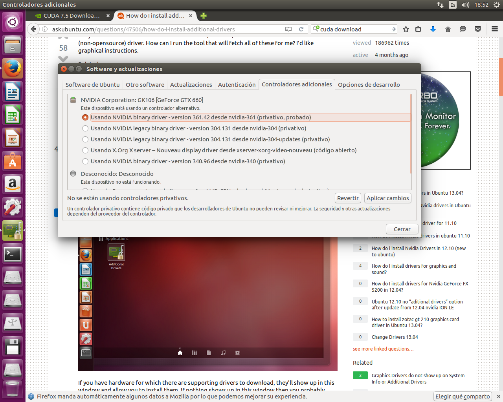

# Instalacion CUDA en Ubuntu 16.04 LTS

## Informacion del Equipo

> - Kernel Ubuntu 5.3.1-14ubuntu2
> - gcc 5.3.1
> - Arquitectura: x86_64
> - CPU: AMD Phenom 9550 Quad-Core Processor
> - CPU MHz: 22210.175
> - Caché L1d: 64K
> - Caché L1i: 64k
> - Caché L2: 512K
> - Caché L3: 2048K
> - NUMA node0 CPU(s): 0-3
> - 6GB RAM DDR2 (x2 1034MB + x2 2048MB)
> - Nvidia GeForce GTX 660 2048MB GDDR5

## Preparando el entorno

En cuanto tengamos cargado el SO ejecutaremos `apt-get update && apt-get upgrade`, reiniciamos y nos dirigimos a **"Software & Updates" -> "Controladores Adicionales"** y ponemos los drivers propietarios de nvidia como se puede ver en la siguiente imagen;



El siguiente paso que tendremos que hacer es descargarnos cuda e instalarlo manualmente.

## Descargando CUDA

Opciones a la hora de descargar cuda:

1. Descargar **.deb local file**: con esta opción nos descargamos el paquete .deb completo y lo instala el gestor de paquetes del sistema. Pero el problema es que con la versión 16 los repositorios de xenial consideran que la clave pgp que trae este paquete es demasiado débil ya que está firmada con SHA1 y ahora sólo se admiten SHA256 y SHA512.

2. Descargar **.deb network file**: con esta opción tendremos el mismo inconveniente que con la anterior.

3. Descargar **.run file**: esta es la que he elegido por simplicidad y por que no me ha causado problemas.

Podemos descargarnoslo desde la propia web de nvidia [https://developer.nvidia.com/cuda-downloads](https://developer.nvidia.com/cuda-downloads).
Es aconsejable instalar el archivo `.run` debido a que **NO** nos dará problemas de clave pública como los .deb por las razones comentadas anteriormente.

Una vez descargado tendremos que darle permisos de ejecución.

```bash
$ sudo chmod +x cuda_7.5.18_linux.run
```

## Dependencias

Como en la web de nvidia sólo dan soporte hasta Ubuntu 15.04 tendremos que instalar las dependencias necesarias de esa versión para cuda.

Las dependencias son:
```bash
ca-certificates-java default-jre default-jre-headless fonts-dejavu-extra freeglut3 freeglut3-dev java-common libatk-wrapper-java libatk-wrapper-java-jni  libdrm-dev libgl1-mesa-dev libglu1-mesa-dev libgnomevfs2-0 libgnomevfs2-common libice-dev libpthread-stubs0-dev libsctp1 libsm-dev libx11-dev libx11-doc libx11-xcb-dev libxau-dev libxcb-dri2-0-dev libxcb-dri3-dev libxcb-glx0-dev libxcb-present-dev libxcb-randr0-dev libxcb-render0-dev libxcb-shape0-dev libxcb-sync-dev libxcb-xfixes0-dev libxcb1-dev libxdamage-dev libxdmcp-dev libxext-dev libxfixes-dev libxi-dev libxmu-dev libxmu-headers libxshmfence-dev libxt-dev libxxf86vm-dev lksctp-tools mesa-common-dev x11proto-core-dev x11proto-damage-dev x11proto-dri2-dev x11proto-fixes-dev x11proto-gl-dev x11proto-input-dev x11proto-kb-dev x11proto-xext-dev x11proto-xf86vidmode-dev xorg-sgml-doctools xtrans-dev libgles2-mesa-dev nvidia-modprobe build-essential
```

## Instalación de CUDA

Uso el modificador --override para que no aparezca el error de "Toolkit:  Installation Failed. Using unsupported Compiler."

Tendremos que asegurarnos de **NO instalar el driver** que nos ofrece el asistente. No obstante dejo la salida de la instalación que he realizado.

```bash
$ sudo ./cuda_7.5.18_linux.run --override
-------------------------------------------------------------
Do you accept the previously read EULA? (accept/decline/quit): accept
You are attempting to install on an unsupported configuration. Do you wish to continue? ((y)es/(n)o) [ default is no ]: y
Install NVIDIA Accelerated Graphics Driver for Linux-x86_64 352.39? ((y)es/(n)o/(q)uit): n
Install the CUDA 7.5 Toolkit? ((y)es/(n)o/(q)uit): y
Enter Toolkit Location [ default is /usr/local/cuda-7.5 ]:
Do you want to install a symbolic link at /usr/local/cuda? ((y)es/(n)o/(q)uit): y
Install the CUDA 7.5 Samples? ((y)es/(n)o/(q)uit): y
Enter CUDA Samples Location [ default is /home/kinghorn ]: /usr/local/cuda-7.5
Installing the CUDA Toolkit in /usr/local/cuda-7.5 ...
Finished copying samples.

===========
= Summary =
===========

Driver:   Not Selected
Toolkit:  Installed in /usr/local/cuda-7.5
Samples:  Installed in /usr/local/cuda-7.5
```

## Variables de entorno para CUDA

```bash
$ mkdir $HOME/project
$ sudo emacs -nw /etc/profile.d/cuda.sh

export PATH=$PATH:/usr/local/cuda/bin

$ sudo emacs -nw /etc/ld.so.conf.d/cuda.conf

/usr/local/cuda/lib64

$ source /etc/profile.d/cuda.sh
$ sudo ldconfig
```

## Forzando a gcc 5 para que trabaje con CUDA

Tenemos que hacer un pequeño cambio en la cabecera de la configuración de gcc para permitir versiones superiores a la 4.8 para ello:

```bash
$ sudo emacs -nw /usr/local/cuda/include/host_config.h

# comentar linea: 115 solo el error
//#error -- unsupported GNU version! gcc versions later than 4.9 are not supported!
```

## Documentación de CUDA

Obligatorios

- [CUDA Docs](http://docs.nvidia.com/cuda/index.html#axzz48jHKWvlH)
- [Compilador NVCC](http://docs.nvidia.com/cuda/cuda-compiler-driver-nvcc/index.html#axzz48jHKWvlH)
- [Tecnologías](https://developer.nvidia.com/key-technologies)
- [CUDA Education](https://developer.nvidia.com/cuda-education-training)
- [CUDA Additional Resources](https://developer.nvidia.com/additional-resources)

Opcionales
- [Librerias](https://developer.nvidia.com/gpu-accelerated-libraries)
- [OpenACC](https://developer.nvidia.com/openacc)
